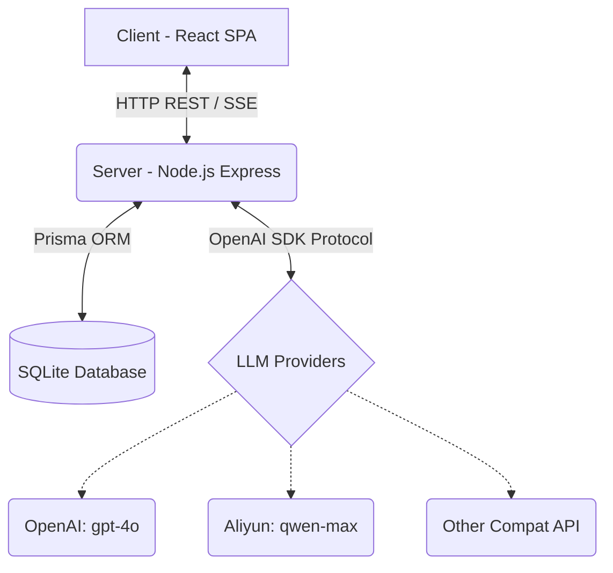

# 智能公众号文案创作 Agent 平台 - 系统设计文档 (System Design)

## 1. 技术栈选型
根据系统轻量级、多用户以及AI流式交互的特点，做如下核心选型：

- **前端 (Client)**
  - 构建框架：React + Vite (开发体验极佳，构建速度快)
  - 路由管理：React Router dom v6
  - 状态管理：Zustand (轻量、无样板代码，非常适合中小型Agent应用)
  - 样式流派：Vanilla CSS / CSS Modules (严格控制样式不使用 Tailwind，通过手写 CSS 实现具有呼吸感和微动画的高级视觉体验)
  - 富文本渲染：推荐使用 Tiptap 或 Quill.js（易于获取结构化内容，兼容 Markdown，支持扩展出 AI Inline 生成效果）
- **后端 (Server)**
  - 核心框架：Node.js + Express (快速搭建 RESTful 和 SSE 接口)
  - AI 交互引擎：直接使用官方 `openai` Node SDK。通过代码中复写 `baseURL` 和 `apiKey`，无缝兼容 Qwen（通义千问）、DeepSeek、OpenAI 等任意兼容格式的大模型。
  - 数据库与ORM：SQLite + Prisma。SQLite 完美契合轻量化、易迁移、0部署的需求；Prisma 提供了极佳的 TypeScript 类型支持。后期如果需要集群部署，只需修改 Prisma 连接串一键切换至 PostgreSQL。

## 2. 系统架构设计

### 2.1 基础架构图 (简述)


### 2.2 数据库 Schema 设计 (Prisma 模型)

1. **User (`User`)**
   - `id`: String (UUID 主键)
   - `username`: String (唯一账号)
   - `password_hash`: String (加密密码)
   - `created_at`: DateTime

2. **AiConfig (`AiConfig`)**
   - `id`: String (UUID)
   - `user_id`: String (外键 -> User)
   - `provider_name`: String (例如 'openai', 'qwen')
   - `api_key`: String (采用后端加盐加密存储)
   - `base_url`: String (自定义API网关地址)
   - `model_name`: String

3. **Article (`Article`)**
   - `id`: String (UUID)
   - `user_id`: String (外键 -> User)
   - `topic`: String (用户输入的原始主题)
   - `outline`: String (存储 JSON 格式化的大纲信息)
   - `content`: String (最终文案或草稿内容)
   - `status`: String (Enum: `DRAFT`, `OUTLINE_DONE`, `COMPLETED`)
   - `created_at` / `updated_at`: DateTime

## 3. 核心 API 端点设计

### 3.1 账号与鉴权 (Auth)
- `POST /api/auth/register` - 注册账号
- `POST /api/auth/login` - 检查凭证并返回 JWT (JSON Web Token)
- *(鉴权中间件)* 将放置于业务API前拦截未经授权的访问。

### 3.2 配置模块 (Config)
- `GET /api/user/config` - 获取当前用户的 AI 配置列表
- `POST /api/user/config` - 保存或更新 AI 配置
- `POST /api/user/config/test` - (可选) 发送一组快速 ChatCompletion 请求探测 Key 是否有效。

### 3.3 文案工作流引擎 (Agent Workflow)
- `POST /api/workflow/outline` - **生成大纲**
  - **请求体**: `{ "topic": "职场解压", "target_audience": "白领" }`
  - **逻辑**: Server 聚合用户的 `AiConfig` 使用 `openai` SDK 发起请求，强制要求 LLM 返回 JSON 格式大纲。
- `POST /api/workflow/generate` - **基于大纲生成全文 (SSE 边缘端流式响应)**
  - **请求体**: `{ "article_id": "...", "final_outline": {...} }`
  - **返回**: `text/event-stream`，前端一字一句进行渲染。
- `PUT /api/article/:id` - **保存文章编辑和状态**
- `GET /api/article` - **获取历史文章列表**

## 4. 核心 Agent Prompt 编排策略
将复杂的生成过程拆包为多步调用，增强内容可控性。

### 4.1 大纲生成 Prompt
```text
System: 你是一个资深的微信公众号运营爆款推手。你的任务是基于用户提供的主题，设计一份高质量的文章大纲。
必须输出符合以下 JSON 格式的数据：
{
  "titles": ["备选标题1", "备选标题2", "备选标题3"],
  "style": "推荐的语言风格（如幽默、深刻）",
  "background": "读者需要了解的前提背景或痛点扩展",
  "sections": [
    { "title": "段落核心点", "desc": "该段落主要讲解的内容，顺序是什么" }
  ]
}

User: 帮我写一篇关于 [用户输入主题] 的推文大纲。
```

### 4.2 全文生成 Prompt
```text
System: 你是资深金牌公众号撰稿人。请根据我们经过确认的大纲，撰写第一人称或第三人称视角（取决于大纲风格设定）的公众号推文。
大纲信息：[大纲注入点]
要求：
1. 语言风格严格依照大纲设定进行。
2. 支持使用 Markdown 排版增强可读性，多加一些金句。
3. 全文要具有连贯的表达逻辑，切入痛点要准。

User: 请开始撰写整篇内容并输出完整文案。
```

## 5. 安全与性能最佳实践
- **鉴权凭据安全**：用户提供的 `API Key` 不能随意查询显示供人复制，仅供后端服务端加密后发起请求时在内存中解密使用。
- **防止连接超时**：大模型生成全文时间较长（20-60秒不等），必须采用 HTTP SSE 长连接或 WebSocket，而不是普通长轮询，防止 Gateway 层 504 错误。
